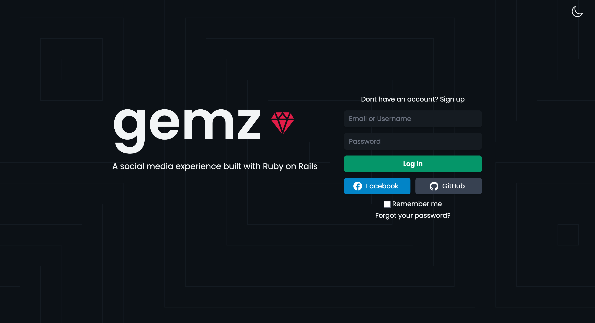
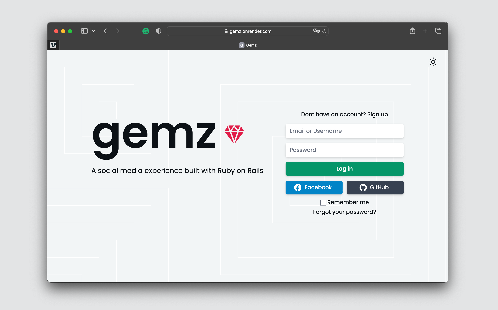
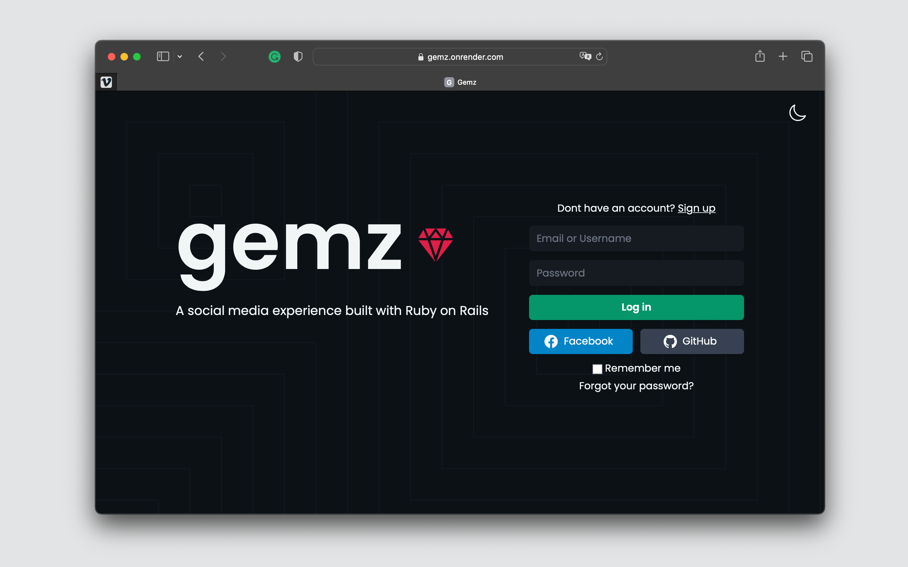
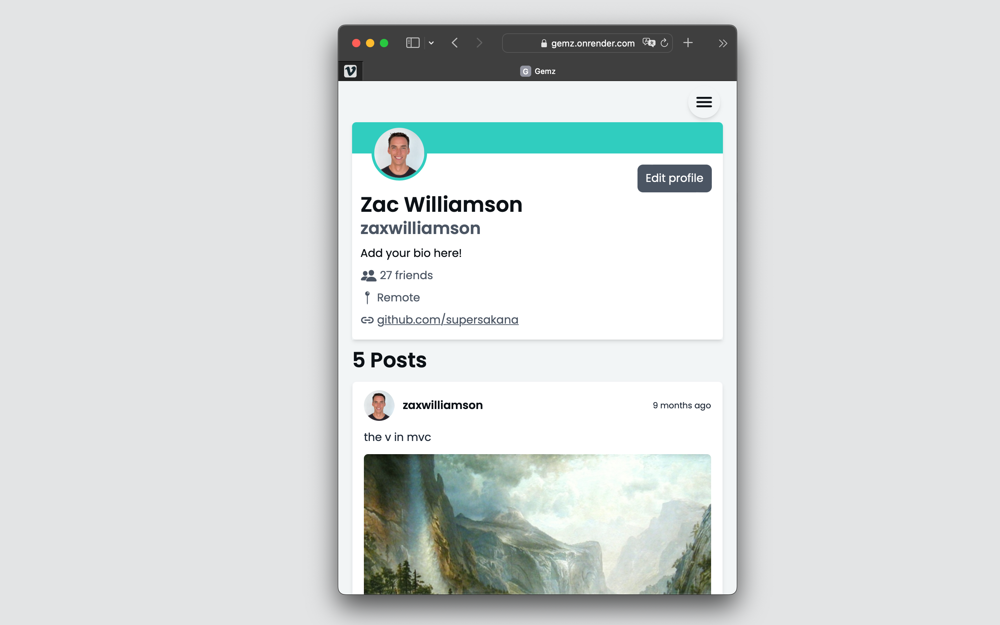
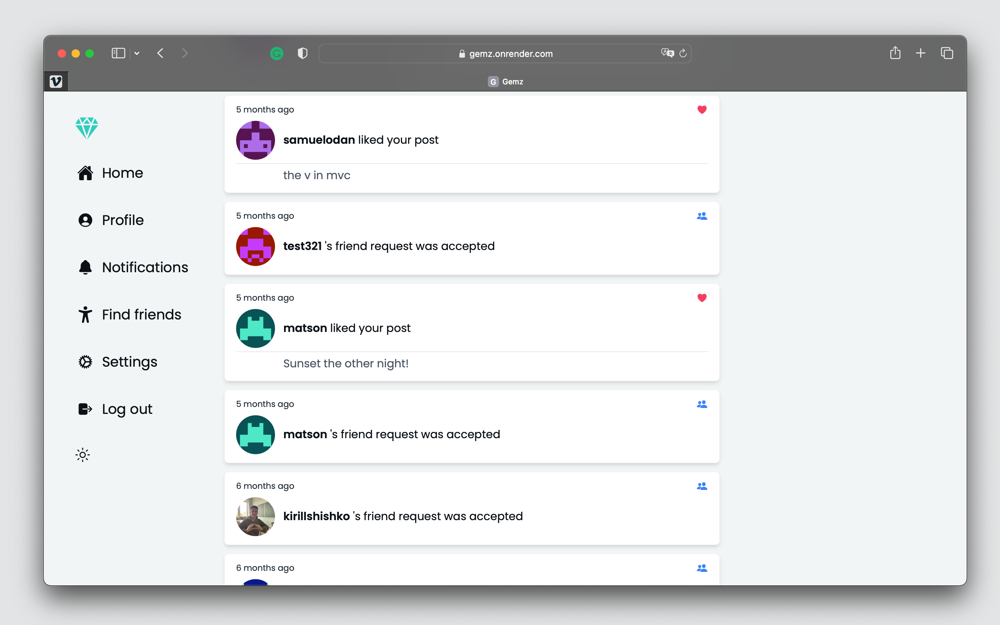
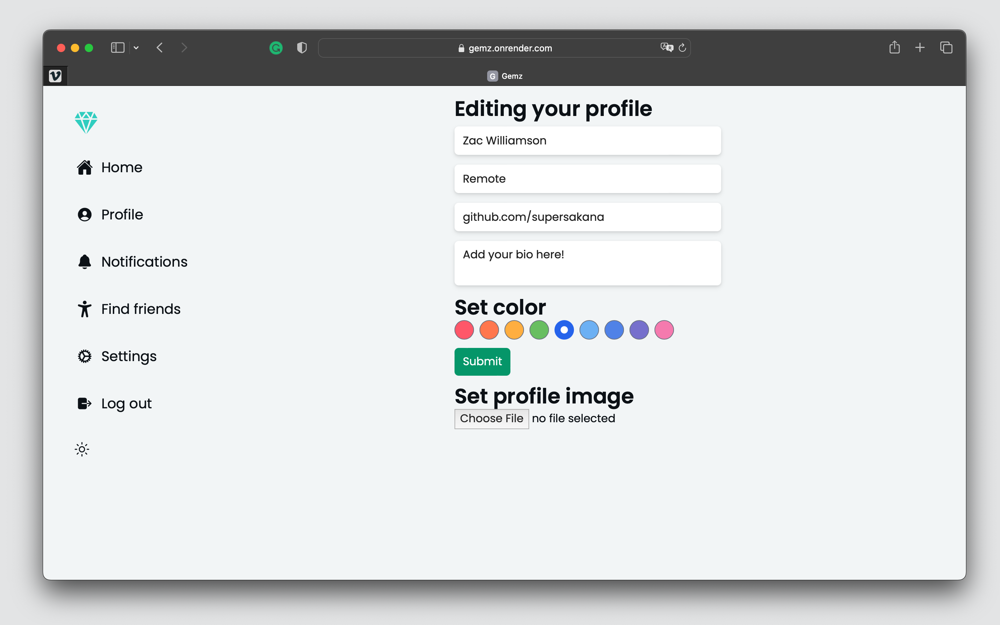
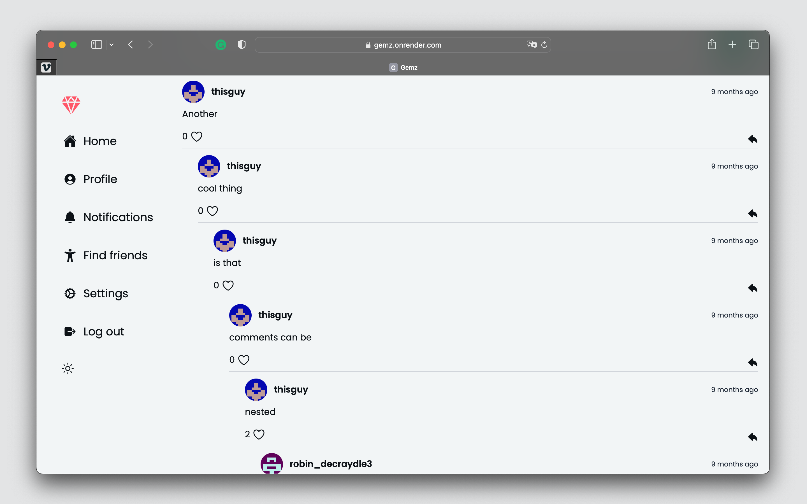
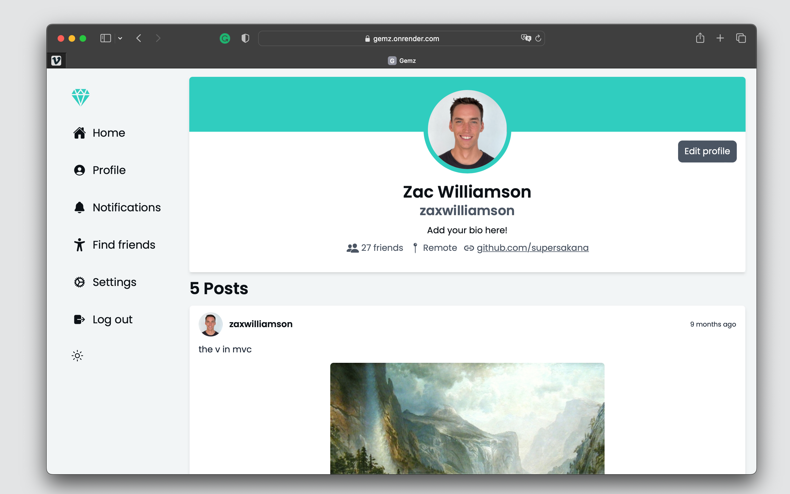

# gemz

A social media experience built with Ruby on Rails. [Live Preview](https://gemz.onrender.com)

## About

Gemz was created based on The Odin Project's criteria for building a [Facebook Clone](https://www.theodinproject.com/lessons/ruby-on-rails-rails-final-project). My goal was to hit the project specs first, then experiment by adding new features. Writing simple integration and unit tests became an important part of my workflow. This would verify what was or was not working when developing.

Areas I get to improve would be organizing my code, testing, and styling the app properly. My attitude throughout this was to _just get it working_ and then identify blindspots after. If you the reader see areas I can improve, feel free to make an issue or email me at zacwilliamson@icloud.com. I'm always looking to improve my skills.

## Features

- Log in / Log out

  - utilized [Devise](https://github.com/heartcombo/devise) so users can register or create new sessions
  - OAuth allows users to login with Facebook or Github

- Profile

  - when a new user signs up, a profile is created with a default color theme
  - users can add location, link, bio, full name, and profile image (default gravitar image)

- Posts

  - users can write posts and attach an image
  - posts can have many likes and comments

- Comments

  - can have many likes
  - users can reply to others (nested comments)
  - nested comments use turbo streams to avoid page reloads, append comments, and update the comment count.
  - stimulus used on reply forms so users can open and close prompts.

- Friendship

  - users can add other users as friends
  - when users are friends, their posts are rendered on eachother's feed.
  - uses turbo streams to avoid page reloads when requests are created, canceled, declined, or accepted

- Notifications

  - can take many forms (polymorphic)
  - notified when a reply is made to their comment
  - notified when comments are made on user's post
  - notified when post recives likes
  - notified when friendships are requested and accepted

- Mailer

  - welcome email is sent when new user is created

- Testing

  - wrote unit and system specs with RSpec/Capybara

- Styling

  - styled with Tailwind CSS
  - different layout renders if user is logged in or not
  - profile color is displayed based on users profile settings
  - notification icons vary based on notifiable type.

## Known bugs

- On mobile view, when a page is loading, the menu bar is displayed open
- The server can be slow to load some pages/data based on location.

## Photos

